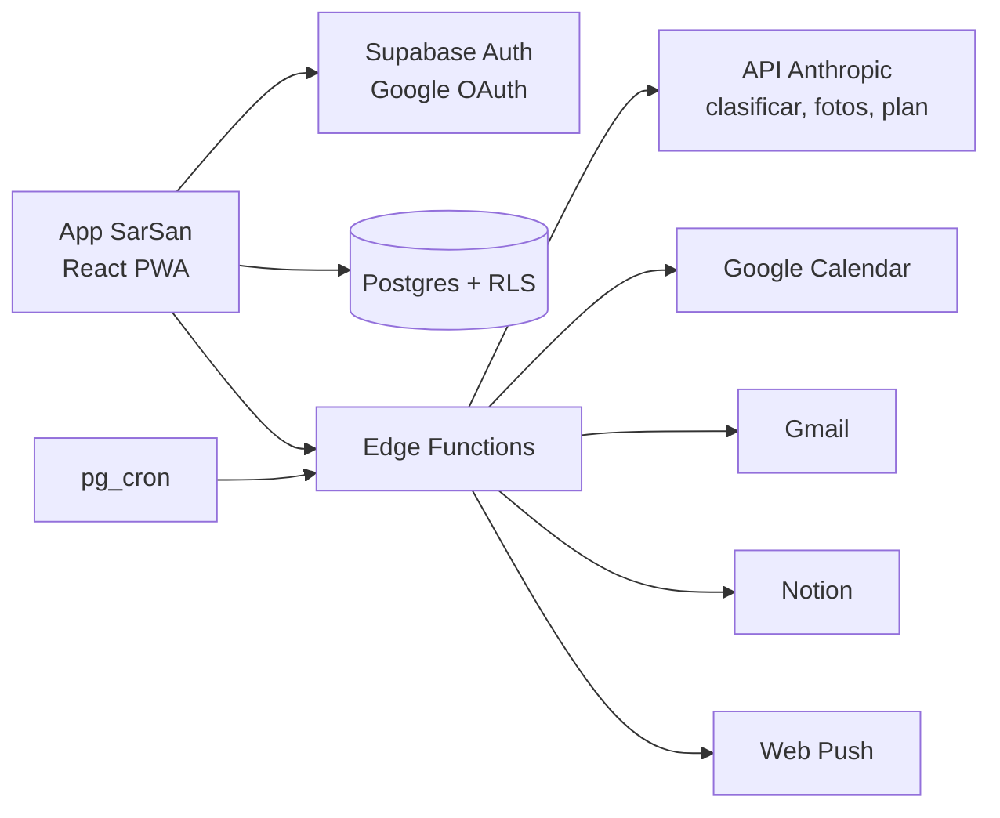
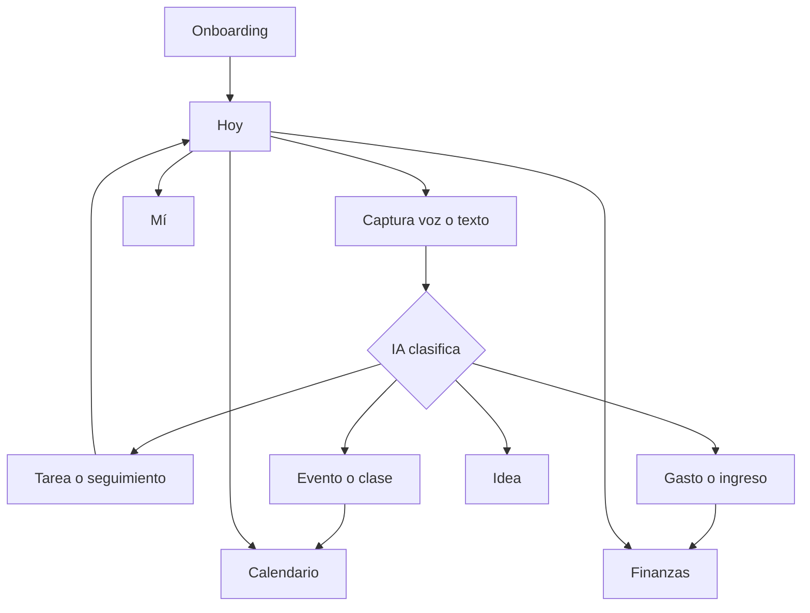
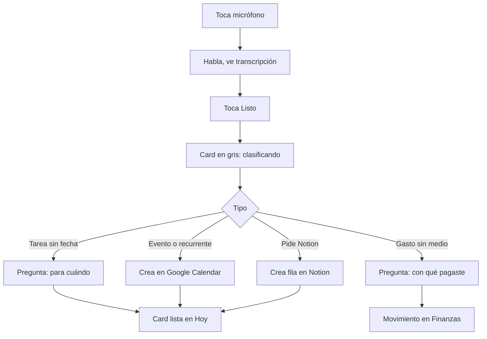

# SarSan — Blueprint, flujo de usuario y prompt para Claude Code

2026-09-22 · Sarah

## Resumen

SarSan es una app móvil personal donde Sarah suelta todo por voz y la IA lo ordena: tareas, eventos, gastos, hábitos y bienestar en un solo lugar. Las pantallas de Lovable son solo la referencia visual: varias no funcionan y su código no se reutiliza. Claude Code construye la app completa, frontend y backend, replicando esa estética.

Principios que guían cada decisión:

- **Capturar cuesta un toque.** El micrófono es la acción principal; nada exige llenar formularios.
- **La IA ordena, Sarah decide.** Todo lo que la IA clasifica se puede corregir, y la app aprende de esas correcciones.
- **Preguntar solo lo necesario.** Si falta la fecha de una tarea o el medio de pago de un gasto, la app pregunta una vez.
- **Trabajar con la energía, no contra ella.** El día se organiza en franjas calculadas desde la hora de despertar.
- **Un solo lugar.** Google Calendar, Gmail y Notion se integran; no se reemplazan.

## Blueprint técnico

La app se construye desde cero en React + Vite + Tailwind + shadcn, usando las pantallas de Lovable solo como referencia visual, con Supabase como backend completo. La IA corre en Edge Functions con la API de Anthropic, y las integraciones usan OAuth de Google y Notion.

### Arquitectura



El cliente nunca habla directo con Anthropic, Google ni Notion: todo pasa por Edge Functions, que guardan los tokens y las llaves.

### Stack

| Capa | Tecnología | Para qué |
| --- | --- | --- |
| Frontend | React + Vite + TypeScript + Tailwind + shadcn | Pantallas nuevas y funcionales con la estética de Lovable |
| Estado y datos | TanStack Query + Supabase JS | Caché, tiempo real, optimistic updates |
| Auth | Supabase Auth con Google | Login + permisos de Calendar y Gmail en el mismo paso |
| Base de datos | Postgres con Row Level Security | Cada fila solo la ve su dueña |
| Archivos | Supabase Storage | Logos de etiquetas y fotos de comida |
| Lógica | Supabase Edge Functions (Deno) | IA, integraciones, notificaciones |
| Tareas programadas | pg_cron | Recordatorios por franja y cierre del día |
| IA rápida | claude-haiku-4-5 | Clasificar capturas |
| IA fuerte | claude-sonnet-5 | Fotos de comida y "Organizar mi día" |
| Voz | Web Speech API (es-CO) | Dictado en el navegador |
| Notificaciones | Web Push con VAPID + service worker | Avisos en iPhone (app instalada) y Android |
| Widgets (fase final) | Capacitor + extensión nativa WidgetKit / App Widgets | Widgets en pantalla de inicio |

### Módulos

| Módulo | Qué hace |
| --- | --- |
| Captura | Voz o texto → IA → tarea, evento, gasto, ingreso, idea o seguimiento. Pregunta fecha o medio de pago si faltan. |
| Hoy | Franjas de energía, chips de etiquetas, pendientes ordenados por fecha y urgencia, "Organizar mi día". |
| Calendario | Vistas Día, 3 días y Mes estilo Google; resumen de horas ocupadas; crea eventos y recurrencias en Google Calendar. |
| Mí | No negociables con racha, lecturas con resumen, agua, comida con foto y calorías, energizantes, ciclo menstrual. |
| Finanzas | Gastos e ingresos por voz, medio de pago, categorías, totales por mes, alerta de tarjetas de crédito. |
| Etiquetas | Nombre, descripción para la IA, color, emoji y logo; editables; la IA aprende de las correcciones. |
| Integraciones | Google Calendar (leer y crear), Gmail (hilos SAPQ), Notion (crear filas bajo pedido). |
| Notificaciones | Aviso al inicio de cada franja de energía alta, recordatorio nocturno de no negociables, vencimientos. |

### Franjas de energía

Se calculan desde la hora de despertar (por defecto 6:00) según el ritmo circadiano de atención: baja las primeras 3 horas, pico entre las horas 4 y 7, bajada entre las 8 y 9, segundo pico entre las 10 y 15, y caída después.

| Franja | Horas desde despertar | Energía | Con despertar 6am |
| --- | --- | --- | --- |
| Arranque | 0–3 | Media-baja | 6–9am |
| Foco | 3–7 | Alta | 9am–1pm |
| Bajón | 7–9 | Baja | 1–3pm |
| Segundo aire | 9–14 | Alta | 3–8pm |
| Cierre | 14–dormir | Baja | 8–10pm |

### Modelo de datos

Todas las tablas llevan `user_id` (uuid, referencia a `auth.users`), `created_at` y RLS con la política `user_id = auth.uid()`.

| Tabla | Campos principales |
| --- | --- |
| `profiles` | nombre, hora_despertar, hora_dormir, edad, estatura_cm, peso_kg, actividad, botella_ml, botellas_meta, zona_horaria |
| `tags` | nombre, descripcion, color, emoji, logo_path, orden, es_default |
| `items` | texto, texto_original, tipo, tag_id, urgencia, fecha, hora, duracion_min, recurrencia (jsonb: dias, inicio, hasta), done, done_dates, franja, franja_dia, gcal_event_id, gcal_status, notion_page_id, notion_status, clasificando |
| `tag_hints` | texto, tag_id — correcciones que la IA usa como ejemplos |
| `transactions` | tipo (gasto/ingreso), monto, categoria_id, medio_id, fecha, texto |
| `payment_methods` | nombre, tipo (efectivo, débito, crédito, transferencia), orden |
| `money_categories` | tipo, nombre, emoji |
| `habits` | nombre, emoji, orden, activo |
| `habit_logs` | habit_id, dia, hecho |
| `readings` | dia, libro, resumen |
| `water_logs` | dia, botellas |
| `food_logs` | dia, comida, nombre, kcal, kcal_min, kcal_max, proteina_g, carbos_g, grasa_g, confianza, foto_path |
| `drinks` | nombre, emoji, mg_cafeina |
| `energy_logs` | drink_id, mg, consumido_at |
| `cycle_logs` | inicio (fecha) |
| `integrations` | proveedor, tokens cifrados, scopes, expira_at, notion_database_id |
| `push_subscriptions` | endpoint, p256dh, auth, dispositivo |
| `notification_prefs` | por_franja, cierre_hora, vencimientos |

### IA (Edge Functions)

| Función | Modelo | Entrada → salida |
| --- | --- | --- |
| `classify-capture` | claude-haiku-4-5 | Texto + etiquetas + medios + últimas 20 correcciones → JSON con tipo, etiqueta, fecha, hora, duración, recurrencia, monto, medio, categoría, pedir_notion, texto_limpio |
| `estimate-food` | claude-sonnet-5 (visión) | Foto o descripción → nombre, kcal con rango, macros, confianza |
| `plan-day` | claude-sonnet-5 | Pendientes + eventos de hoy + franjas + cafeína → resumen de 3 frases + franja por tarea |

Reglas fijas: respuesta solo en JSON validado con Zod; si falla, la captura queda como tarea en General y se puede editar. Montos en pesos colombianos ("18 mil" = 18.000).

### Integraciones

| Servicio | Permisos | Uso |
| --- | --- | --- |
| Google Calendar | calendar.events | Leer eventos del rango visible; crear eventos únicos y recurrentes (RRULE con UNTIL) |
| Gmail | gmail.readonly | Hilos que mencionen SunAce, SAPQ o sunacepq; se muestran en la etiqueta SAPQ |
| Notion | OAuth público de Notion | Crear una fila en la base "SarSan — Tareas" solo cuando se toca "Colocar en Notion" o se dice "ponlo en Notion" |

### Notificaciones

| Aviso | Cuándo | Contenido |
| --- | --- | --- |
| Inicio de franja alta | Al empezar Foco y Segundo aire | La tarea más prioritaria asignada a esa franja |
| Vencimiento | 9am del día de entrega | "Hoy vence: X" |
| Cierre del día | Hora configurable (por defecto 7pm) | No negociables y agua pendientes |
| Corte de cafeína | 30 min antes del corte | Solo si ya consumió cafeína ese día |

### Seguridad y privacidad

- RLS en todas las tablas; ninguna consulta sin `user_id`.
- Tokens de Google y Notion cifrados con `pgsodium` y solo leídos por Edge Functions.
- La llave de Anthropic vive en los secretos de Supabase, nunca en el cliente.
- Fotos y logos en buckets privados con URLs firmadas.
- Datos de salud (comida, ciclo) nunca salen hacia Notion ni Google.

## Flujo completo del usuario

El recorrido tiene un núcleo: capturar → la IA clasifica → la app pregunta lo que falta → el ítem aparece donde corresponde. Todo lo demás (Hoy, Calendario, Mí, Finanzas) es una forma de ver y cerrar lo capturado.

### Mapa general



Desde Hoy se llega a todo en un toque, y cualquier captura termina en la pantalla que le toca.

### 1. Onboarding (una sola vez)

1. Abre SarSan y entra con Google. En el mismo paso acepta Calendar y Gmail.
2. Responde tres cosas: a qué hora se levanta, a qué hora se duerme y su edad. Estatura y peso ya vienen (147 cm, 51 kg) y se pueden cambiar.
3. Ve sus etiquetas por defecto y puede subir logos o cambiar emojis.
4. Revisa sus medios de pago (Efectivo, Davivienda, Nu, Nequi, Llave) y sus no negociables.
5. Activa notificaciones. En iPhone la app le indica cómo instalarla en la pantalla de inicio primero.
6. Opcional: conecta Notion y elige dónde crear la base "SarSan — Tareas".

### 2. Captura (el flujo central)



La card aparece al instante (antes de que responda la IA) para que nada se sienta perdido. Si la IA falla, queda como tarea en General y se edita a mano.

Ejemplos de lo que debe entender:

| Lo que dice Sarah | Resultado |
| --- | --- |
| "Entregar el informe de Virrey el viernes" | Tarea, etiqueta Virrey, vence el viernes, urgencia media |
| "Clase de Materiales lunes y miércoles de 7 a 9 hasta el 30 de noviembre" | Evento recurrente, Universidad, creado en Google Calendar |
| "Almuerzo 18 mil con Nequi" | Gasto de $18.000, Comida, Nequi |
| "Me pagaron 800 mil de SAPQ a Davivienda" | Ingreso, categoría SAPQ, Davivienda débito |
| "Llamar a Lucas" | Tarea, etiqueta Lucas, pregunta para cuándo |
| "Montar el curso en el campus y ponlo en Notion" | Tarea SAPQ, pregunta fecha, se envía a Notion |

### 3. Hoy

1. Ve la fecha, las 5 franjas de energía y cuál está viviendo ahora.
2. Toca una franja para ver su tip, sus eventos y sus tareas asignadas. Si la toca de nuevo, abre el Calendario en ese día.
3. Filtra por etiqueta con los chips, o crea una nueva con "＋ Nueva etiqueta".
4. Toca "Organizar mi día": recibe un resumen y cada tarea queda con su franja.
5. Marca tareas como hechas, las mueve de etiqueta tocando el tag, o las envía a Notion.

### 4. Calendario

1. Entra en vista Día: ve el resumen de horas ocupadas y libres y en qué se le va el tiempo.
2. Cambia a 3 días o Mes; toca un día del mes para ir a su vista Día.
3. Toca un evento para ver detalles y "Abrir en Google Calendar".
4. Las tareas con hora aparecen como bloques punteados; las de solo fecha, en la fila de todo el día.

### 5. Mí

1. Ve el anillo de no negociables del día y marca cada uno.
2. Al marcar "Leer 20 minutos" se abre el resumen de la lectura (escrito o dictado).
3. Toca sus botellas o +¼, +½, +1 para el agua.
4. Toma foto de su comida, elige si es desayuno, almuerzo, cena o snack, y recibe calorías y macros. Ese no negociable se marca solo.
5. Registra un energizante con un toque y ve su cafeína del día y su hora de corte.
6. Toca "Me llegó" para registrar su ciclo y ve la gráfica de duraciones.

### 6. Finanzas

1. Escribe o dicta un gasto en el campo rápido.
2. Si no dijo con qué pagó, elige el medio en el bottom sheet.
3. Ve el total del mes, las barras por categoría, los totales por medio de pago y lo cargado a tarjetas de crédito.
4. Cambia a Ingresos o navega entre meses; edita categorías y medios cuando quiera.

### 7. Un día típico con notificaciones

| Hora | Qué pasa |
| --- | --- |
| 6:00am | Se levanta; la app está en Arranque |
| 9:00am | Aviso: "Arrancas Foco. Prioridad: informe de Virrey" + "Hoy vence: X" |
| 1:00pm | Bajón: la app sugiere reuniones o trámites |
| 3:00pm | Aviso: "Segundo aire. Sigue con: wireframe de Twelve Sent" |
| 3:30pm | Si tomó cafeína: "En 30 min es tu hora de corte" |
| 7:00pm | Aviso: "Te faltan 2 botilitos y la crema" |
| 10:00pm | Cierre: revisa lo pendiente y lo mueve a mañana |

## Plan por fases para Claude Code

Claude Code trabaja mejor en fases cortas que se prueban antes de seguir. Cada fase termina con algo que Sarah puede usar en el cel.

| Fase | Qué se construye | Listo cuando |
| --- | --- | --- |
| 0. Auditoría | Extraer de Lovable solo el sistema visual (colores, tipografías, radios, espaciados, componentes) en docs/design-system.md, mapear pantallas, escribir `CLAUDE.md` y `docs/plan.md` | Hay un sistema de diseño y un mapa de pantallas → datos que Sarah aprueba |
| 1. Base | Proyecto nuevo con el sistema visual y la navegación; Supabase: esquema, RLS, seeds, Auth con Google, perfil y onboarding | Sarah entra con Google y ve sus etiquetas, medios y hábitos |
| 2. Captura + IA | `classify-capture`, voz, preguntas de fecha y medio, aprendizaje de correcciones | Los 6 ejemplos del flujo se clasifican bien |
| 3. Hoy | Franjas, chips, pendientes, `plan-day` | "Organizar mi día" asigna franjas y el resumen aparece |
| 4. Calendario | Lectura y creación en Google Calendar, recurrencias, vistas Día/3 días/Mes | Una clase recurrente dicha por voz aparece en Google Calendar |
| 5. Mí | Hábitos, lecturas, agua, `estimate-food`, energizantes, ciclo | Una foto de almuerzo devuelve kcal y marca "Almorzar" |
| 6. Finanzas | Movimientos, medios, categorías, resúmenes | "Almuerzo 18 mil con Nequi" aparece bien sumado |
| 7. Integraciones | Gmail SAPQ, Notion bajo pedido, logos de etiquetas | "Colocar en Notion" crea la fila |
| 8. Notificaciones | Service worker, Web Push, pg_cron, preferencias | Llega el aviso de Foco al cel |
| 9. Pulido | Estados vacíos, errores, modo oscuro, offline básico, pruebas | Pasa el checklist de la sección de prompt |
| 10. Widgets | Capacitor + widget de iOS y Android con pendientes y agua | El widget muestra la próxima tarea |

Antes de la fase 1, Sarah necesita tener listas estas credenciales:

- [ ] Proyecto de Supabase (URL y anon key; service role solo en secretos)
- [ ] Llave de la API de Anthropic
- [ ] Proyecto en Google Cloud con OAuth, Calendar API y Gmail API activas
- [ ] Integración pública de Notion (client id y secret)
- [ ] Llaves VAPID para Web Push (Claude Code puede generarlas)

## Prompt para Claude Code

Pégalo en Claude Code desde una carpeta nueva. Pon ahí el export o las capturas de Lovable en reference/lovable/ como referencia visual. Para mejores resultados, guarda antes este documento en el repo como `docs/blueprint.md`: el prompt le dice a Claude Code que lo lea.

```markdown
Eres el ingeniero principal de SarSan, una app móvil personal de productividad y bienestar. Tengo pantallas hechas en Lovable en reference/lovable/, pero son SOLO referencia visual: varias no funcionan y su código no se reutiliza. Trátalas como un Figma. Tu trabajo es construir la app completa desde cero, frontend y backend, replicando fielmente su estética: colores, tipografías, espaciados, radios, componentes y layout. No copies su lógica, su estado ni su estructura de archivos.

Lee primero docs/blueprint.md: ahí están la arquitectura, el modelo de datos, los flujos y las fases. Si algo de este prompt y el blueprint se contradicen, gana el blueprint y me avisas.

## Quién la usa
Yo: diseñadora UX/UI freelance y estudiante de Diseño Industrial en Bogotá. Olvido tareas porque todo lo tengo en la cabeza o en WhatsApp. SarSan debe dejarme soltar todo por voz y ordenarlo sola. Todo en español de Colombia, tono directo y cálido. Zona horaria America/Bogota, moneda COP.

## Stack obligatorio
- Frontend: proyecto nuevo en React + Vite + TypeScript + Tailwind + shadcn, con la estética de Lovable. TanStack Query + supabase-js para datos. PWA instalable (manifest + service worker).
- Backend: Supabase (Postgres + RLS en todas las tablas, Auth con Google, Storage, Edge Functions en Deno, pg_cron).
- IA: API de Anthropic solo desde Edge Functions. claude-haiku-4-5 para clasificar capturas; claude-sonnet-5 para fotos de comida y para organizar el día. Respuestas en JSON validadas con Zod.
- Voz: Web Speech API con lang es-CO.
- Notificaciones: Web Push con VAPID.
- Nunca expongas llaves ni tokens en el cliente.

## Funcionalidades (todas deben funcionar)

1. Captura
- Micrófono como acción principal y lápiz para escribir. La card aparece al instante en estado "clasificando".
- classify-capture recibe el texto, mis etiquetas (con descripción), mis medios de pago, mis categorías de dinero y mis últimas 20 correcciones, y devuelve: tipo (tarea, evento, seguimiento, idea, gasto, ingreso), tag_id, urgencia, fecha, hora, duracion_min, recurrencia {dias, inicio, hasta}, monto, medio_id, categoria, pedir_notion, texto_limpio.
- Tarea sin fecha → bottom sheet "¿Para cuándo necesitas esto listo?" (Hoy, Mañana, Esta semana, Próxima semana, Elegir fecha, Sin fecha). La urgencia se recalcula por días restantes: ≤1 alta, ≤4 media, resto baja.
- Gasto sin medio → "¿Con qué pagaste?".
- Si falla la IA, queda como tarea en General, editable.
- Cuando muevo una tarea de etiqueta, guarda la corrección en tag_hints.

2. Hoy
- Franjas de energía calculadas desde mi hora de despertar: Arranque (0–3 h, media-baja), Foco (3–7 h, alta), Bajón (7–9 h, baja), Segundo aire (9–14 h, alta), Cierre (hasta dormir, baja). Resalta la actual.
- Chips de etiquetas con logo o emoji, "＋ Nueva etiqueta" y "Editar".
- Pendientes ordenados por fecha y luego urgencia. Las recurrentes aparecen solo los días que tocan y se marcan por día.
- "Organizar mi día" llama a plan-day: resumen de máximo 3 frases + franja para cada tarea (lo exigente en energía alta, no asignar franjas ya pasadas ni encima de eventos).
- Botón "Colocar en Notion" en cada tarea.

3. Calendario (tiene que leerse como Google Calendar)
- Vistas Día, 3 días y Mes; botón Hoy y flechas.
- Día: columna de horas, bloques con los colores de Google (colorId), eventos superpuestos lado a lado, línea roja de la hora actual, fila de todo el día, franjas de energía alta sombreadas.
- Resumen: horas ocupadas vs. libres de mi día despierta y barra por etiqueta.
- Crear eventos únicos y recurrentes en Google Calendar (RRULE semanal con BYDAY y UNTIL). Guardar gcal_event_id y no duplicar en la vista.

4. Mí
- No negociables editables con check diario y racha: Leer 20 minutos, Rutina de abdomen, Ir al gym, Escuchar el evangelio, Crema en el cuerpo, Desayunar, Almorzar, Cenar.
- Al marcar Leer se abre libro + resumen (dictable) y se guarda en readings con historial.
- Agua: 3 botellas de 700 ml (configurable), botones +¼, +½, +1.
- Comida: foto o descripción → estimate-food devuelve nombre, kcal, rango min–max, proteína, carbohidratos, grasa, confianza. Considera comida colombiana. Marca solo el no negociable de esa comida.
- Meta de energía con Mifflin-St Jeor para mujer: 10×peso + 6.25×estatura − 5×edad − 161, por factor de actividad (1.2 / 1.375 / 1.55 / 1.725). Mostrar consumido y lo que falta. Texto fijo: es una estimación con 15–30% de error, enfocada en energía, no en dieta. Nunca mensajes sobre bajar de peso.
- Energizantes de un toque, editables: Red Bull 80 mg, Monster 160, Vive 100 ~100, Amper ~95, Tinto 70, Café grande 150, Coca-Cola 40, Té 40. Barra hacia 400 mg/día y hora de corte = dormir − 6 h.
- Ciclo menstrual: botón "Me llegó", historial y gráfica de duración de ciclos con promedio.

5. Finanzas (inspirado en MonAi)
- Campo rápido con voz: "almuerzo 18 mil con Nequi".
- Gastos / Ingresos, navegación por mes, total grande, barras por categoría con emoji, totales por medio de pago, aviso de lo cargado a tarjetas de crédito, lista por día con subtotales.
- Medios por defecto (editables): Efectivo, Davivienda débito, Davivienda crédito, Nu tarjeta de crédito, Cuenta Nu, Nequi, Llave (Bre-B).
- Categorías editables de gastos e ingresos.

6. Etiquetas
- Nombre, descripción (para la IA), color, emoji y logo subido a Storage. Por defecto: General, SAPQ, Universidad, Twelve Sent, Casa Suba, App videos, Virrey, Effeta, Emihs, Lucas, Personal. General no se puede borrar; al borrar otra, sus tareas pasan a General.

7. Integraciones
- Google (Calendar + Gmail readonly) en el mismo login.
- Gmail: hilos que mencionen SunAce, SAPQ o sunacepq, visibles al filtrar por SAPQ.
- Notion: OAuth; crea la base "SarSan — Tareas" (Tarea, Categoría, Urgencia, Fecha límite, Hecha, Semanal) y solo envía una tarea cuando toco "Colocar en Notion" o digo "ponlo en Notion". Guarda notion_page_id y sincroniza "Hecha" cuando la marco.

8. Notificaciones (pg_cron + Web Push)
- Inicio de Foco y de Segundo aire: la tarea más prioritaria de esa franja.
- 9am: lo que vence hoy.
- Hora configurable (7pm por defecto): no negociables y agua pendientes.
- 30 min antes del corte de cafeína, solo si ya tomé cafeína.
- En iPhone, guiar a instalar la PWA antes de pedir permiso.

## Cómo quiero que trabajes
1. Empieza por la Fase 0: revisa reference/lovable/ solo para extraer el sistema visual (tokens de color, tipografía, radios, espaciados, componentes) y documéntalo en docs/design-system.md; crea CLAUDE.md (convenciones, comandos, estructura) y docs/plan.md con el mapa pantalla → tablas → funciones. Muéstramelo y espera mi OK.
2. Luego avanza fase por fase según el blueprint. Al terminar cada fase: resumen de lo hecho, cómo probarlo en el cel y qué sigue. Espera mi OK antes de la siguiente.
3. Migraciones SQL versionadas en supabase/migrations, con RLS en la misma migración que crea cada tabla. Seeds para mis defaults.
4. Tipos generados de Supabase; nada de any.
5. Pruebas: unitarias para cálculos (franjas, urgencia, Mifflin-St Jeor, rachas, recurrencias) y pruebas de los prompts de IA con los ejemplos del blueprint.
6. Maneja errores de cada integración por separado: si Google falla, el resto de la app funciona y muestra cómo reconectar.
7. Replica la estética de Lovable pantalla por pantalla. Donde falten estados de carga, vacíos o error, o una pantalla no exista, diséñala con el mismo sistema visual.
8. Si necesitas una credencial, pídemela y dime exactamente dónde obtenerla.
9. Antes de borrar archivos, cambiar el esquema de algo existente o instalar dependencias grandes, pregúntame.

## Checklist final
- [ ] Los 6 ejemplos de captura del blueprint se clasifican bien.
- [ ] Una clase recurrente dicha por voz aparece en Google Calendar hasta la fecha fin.
- [ ] La vista Día muestra eventos superpuestos y la línea de hora actual.
- [ ] Una foto de comida devuelve kcal y marca la comida.
- [ ] "Almuerzo 18 mil con Nequi" suma bien en Finanzas.
- [ ] "Colocar en Notion" crea la fila y marcar hecha la actualiza.
- [ ] Llega el aviso de Foco al iPhone con la PWA instalada.
- [ ] RLS impide leer datos de otro usuario (prueba con dos cuentas).
- [ ] Funciona en modo oscuro y respeta las safe areas del iPhone.

Empieza con la Fase 0.
```
